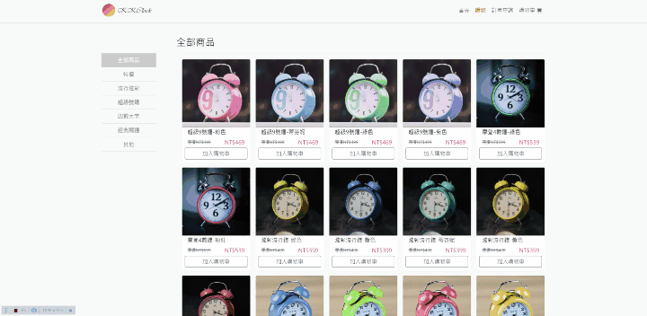

# 虛構品牌kkClock 時鐘專賣電商網站

【DEMO : https://chienyuyu.github.io/kkclock/#/ 】

 

使用Axios串接後端

後端API由六角學院提供
https://github.com/hexschool/vue3-course-api-wiki/wiki
******************
## 使用技術、套件

|  技術/套件   | 簡述  |
| :----- | :----- |
| Vue Cli 3  | 以 Vue.js 開發 SPA 網站 |
| VueRouter  | 設定路由 |
| Bootstrap 5  | 開發 UI 介面 |
| Vue-axios  | 串接 API |
| AOS  | 進場動畫 |
| Swiper  | 特價商品輪播 |
| vue-sweetalert2  | 彈出提示窗 |
****

 

 

 

*****************

 

圖片素材均來自cc0免版權圖庫 Unsplash、Pexels、Pixabay

所有內容純屬虛構、所有商品均無實際販售。

